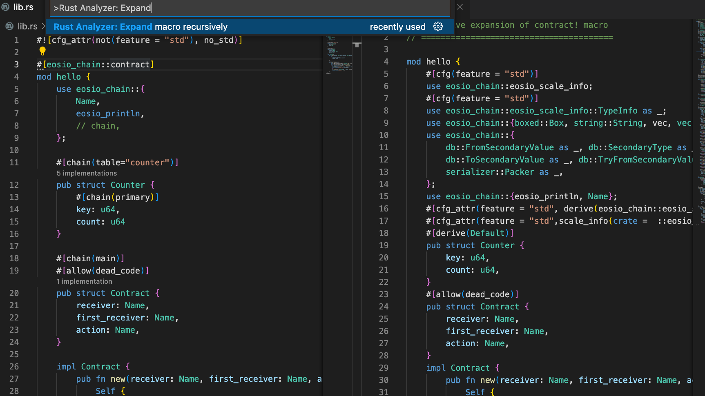

# rust-analyzer

rust-analyzer is a Visual Studio Code extension, it provides support for the Rust programming language

In order to let `rust-analyzer` support for EOS smart contracts development well, switch rust default toolchain to `stable`.

```bash
rustup default stable
```

In order to view the code generate by `eosio_chain::contract` macro, use [`Rust Analyzer: Expand macro recursively`](https://rust-analyzer.github.io/manual.html#expand-macro-recursively)


> Hint: if you have installed `rust-analyzer` with nightly toolchain as default, please disable and then enable it again, otherwise macro expandsion won't work.

Run the following command to check the current rust toolchain

```
rustup default
```

This is what the code after expanding looks like:



